## Purpose of this vignette:

The full STEpUP OA dataset may be made available by application to the Data Access and Publication Group of STEpUP OA (stepupoa@kennedy.ox.ac.uk) once the primary analysis manuscript is published, in accordance with what is stipulated in our Consortium Agreement. The minimal datasets necessary for replicating figures along with the required R code are provided here. 

## Directory structure and the minimal data:

```
##                                      levelName
## 1 minimal datasets                            
## 2  ¦--PC1 Driver - Standardisation            
## 3  ¦--PC1 Driver - Intracellular Protein Score
## 4  ¦--PC2 Driver - Bimodal Signal             
## 5  ¦--Compare to Immunoassay                  
## 6  °--Disease Group After Filtering
```


## Required R packages and file path:

```r
### load in required R packages used to generate plots in the manuscript
library(ggplot2)
library(cowplot)
library(GGally)
library(ggpubr)
library(factoextra)
library(ggforce)
library(scales)

### Set the file path to where the minimal data are downloaded on your personal machine
intermidiate.out <- "/Users/ydeng/Documents/QCpaper.Code/minimal datasets/"
```

## Assessment of Synovial Fluid Standardisation Procedures:
% CV and non-technical variation of each protein, correlation coefficient between SomaScan measure and immunoassay were investigated, and the comparisons across different standardization procedures were displayed as below.

```r
### read in mean % CV values and  mean R2 values for each protein and correlation coefficients assessing agreement between immunoassay and Somascan in order to assess different standardisation procedures 
meanCV <- read.csv(paste0(intermidiate.out,"Standardisation/meanCV.csv"), row.names = 1)
meanR2 <- read.csv(paste0(intermidiate.out,"Standardisation/meanR2.csv"), row.names = 1)
CorDatP.OA <- read.csv(paste0(intermidiate.out,"Standardisation/CorDatP.OA.csv"), row.names = 1)
CorDatP.INJ <- read.csv(paste0(intermidiate.out,"Standardisation/CorDatP.INJ.csv"), row.names = 1)


### Figure 1:

StandardisationLabel = c("Raw Data","HN","HN + PS","HN + PS + MN","HN + PS + MN + PC","HN + PS + PC") ### use these abbreviations for each normalisation step 

p.meanCV <- ggplot(data = meanCV) + geom_point(aes(x=NormalisationSteps,y=100*as.numeric(meanCV),group=DiseaseGroup,col=DiseaseGroup)) + geom_line(aes(x=NormalisationSteps,y=100*as.numeric(meanCV),group=DiseaseGroup,col=DiseaseGroup)) + theme_bw() +
  xlab("") + ylab("\n\nMean %CV") + labs(color = "Disease Group") + scale_x_discrete(breaks=seq(1:length(StandardisationLabel)),labels=StandardisationLabel) + 
  theme(axis.text.x = element_text(size=10, angle=30,face="bold",hjust=1),axis.text.y = element_text(size=10,face="bold"),
        legend.title =element_text(size = 9,face="bold"), legend.text = element_text(size = 9,face="bold"),
        axis.title.y =element_text(size=10,face="bold"),axis.title.x =element_text(size=10)) 

p.meanR2 <- ggplot(data = meanR2) + geom_point(aes(x=NormalisationSteps,y=100*as.numeric(meanR2),group=DiseaseGroup,col=DiseaseGroup)) + geom_line(aes(x=NormalisationSteps,y=100*as.numeric(meanR2),group=DiseaseGroup,col=DiseaseGroup)) +
  xlab("") + ylab(bquote(atop("\n","" ~ bold("Mean R") ^ bold("2")))) + labs(color = "Disease Group") + scale_x_discrete(breaks=seq(1:length(StandardisationLabel)),labels=StandardisationLabel) + theme_bw() +
  theme(axis.text.x = element_text(size=10, angle=30,face="bold",hjust=1),axis.text.y = element_text(size=10,face="bold"),
        legend.title =element_text(size = 9,face="bold"), legend.text = element_text(size = 9,face="bold"),
        axis.title.y =element_text(size=10,face="bold"),axis.title.x =element_text(size=10)) 

p.immunoassay.OA <- ggplot(data = CorDatP.OA) + geom_line(aes(x=as.character(CorC),y=as.numeric(CorDatY),group=CorDatX,col=CorDatX)) + ylim(-0.75,1) + 
  xlab("") + ylab("Correlation Coefficient\n(OA Samples)") +labs(color = "Protein") + scale_x_discrete(breaks=seq(1:length(StandardisationLabel)),labels=StandardisationLabel) + scale_colour_manual(values = c("blue","seagreen","green","blueviolet","red","deepskyblue","hotpink","darkgoldenrod4","orange"))  + theme_bw() + 
  theme(axis.text.x = element_text(size=10, angle=30,face="bold",hjust=1),axis.text.y = element_text(size=10,face="bold"),
        legend.title =element_text(size = 9,face="bold"), legend.text = element_text(size = 9,face="bold"),
        axis.title.y =element_text(size=10,face="bold"),axis.title.x =element_text(size=10))

p.immunoassay.INJ <- ggplot(data = CorDatP.INJ) + geom_line(aes(x=as.character(CorC),y=as.numeric(CorDatY),group=CorDatX,col=CorDatX)) + ylim(-0.75,1) + 
  xlab("") + ylab("Correlation Coefficient\n(Injury Samples)") +labs(color = "Protein") + scale_x_discrete(breaks=seq(1:length(StandardisationLabel)),labels=StandardisationLabel) + scale_colour_manual(values = c("blue","seagreen","green","blueviolet","red","deepskyblue","hotpink","darkgoldenrod4","orange"))  + theme_bw() + 
  theme(axis.text.x = element_text(size=10, angle=30,face="bold",hjust=1),axis.text.y = element_text(size=10,face="bold"),
        legend.title =element_text(size = 9,face="bold"), legend.text = element_text(size = 9,face="bold"),
        axis.title.y =element_text(size=10,face="bold"),axis.title.x =element_text(size=10))

### Figure 1:
p.meanCV
```

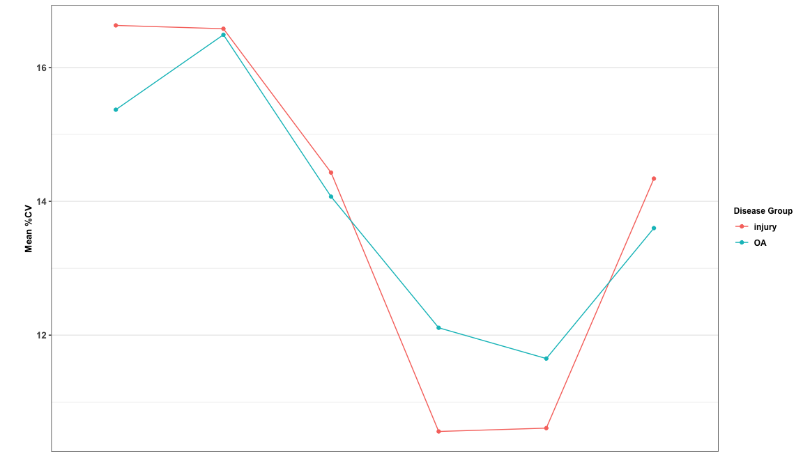<!-- -->

```r
p.meanR2
```

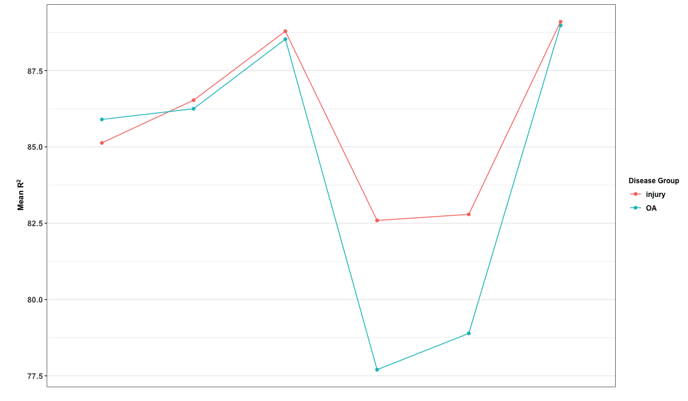<!-- -->

```r
p.immunoassay.OA
```

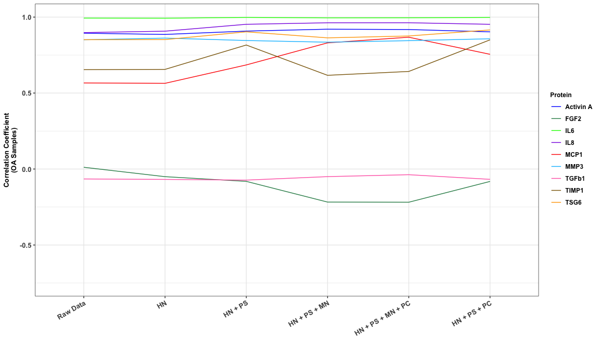<!-- -->

```r
p.immunoassay.INJ
```

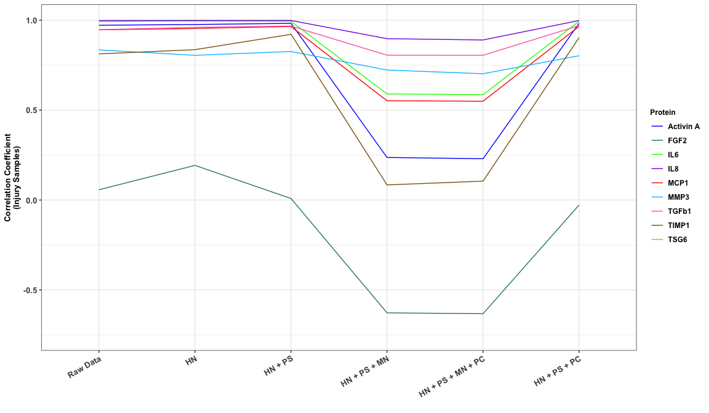<!-- -->


## Investigate the  drivers of PC1  -- Intracellular Protein Score (IPS)
After data standardisation, PC1 explained 48% of data variance which was driven by intracellular protein. The intracellular protein signal can be effectively adjusted for using the limma package. 

### Variation explained by the top 10 PCs after standardisation and adjustment for IPS 

```r
### read in values that correspond to the variance explained by each PC 
val.explained <- read.csv(paste0(intermidiate.out,"PC1 Driver - Intracellular Protein Score/variation.explained.csv"), row.names = 1)

p.variation.PC.before <- ggplot(val.explained[1:10,]) + geom_bar(aes(x=1:10,y=Standardised[1:10]),stat="identity",fill="steelblue") + scale_x_discrete(limits=paste0("PC",1:10)) +
  xlab("") + ylab("Variation Explained (%)") + 
  geom_text(aes(x=1:10,y=Standardised[1:10]+1.5,label=paste0(signif(Standardised[1:10],2),"%")),size=3,fontface = "bold") + theme_bw() + 
  theme(axis.text.x = element_text(size=8,face="bold"),axis.text.y =element_text(size=10,face="bold"),axis.title.y =element_text(size=12.5,face="bold",vjust=-1),
        panel.grid.major.x = element_blank()) 

p.variation.PC.after  <- ggplot(val.explained[1:10,]) + geom_bar(aes(x=1:10,y=IPS.Adjusted[1:10]),stat="identity",fill="steelblue") + scale_x_discrete(limits=paste0("PC",1:10)) +
  xlab("") + ylab("Variation Explained (%)\nafter IPS Adjustment") + theme_bw() + 
  geom_text(aes(x=1:10,y=IPS.Adjusted[1:10]+0.5,label=paste0(signif(IPS.Adjusted[1:10],2),"%")),size=3,fontface = "bold") + theme_bw() + 
  theme(axis.text.x = element_text(size=8,face="bold"),axis.text.y =element_text(size=10,face="bold"),axis.title.y =element_text(size=12.5,face="bold",vjust=-1),
        panel.grid.major.x = element_blank()) 

### Generate subplots of Figure 2:
p.variation.PC.before
```

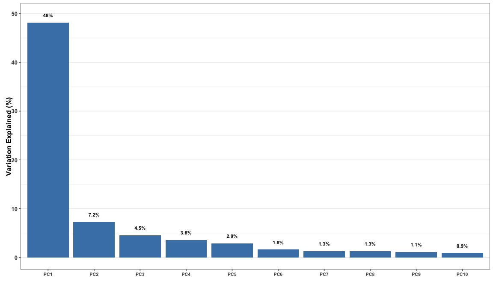<!-- -->

```r
p.variation.PC.after
```

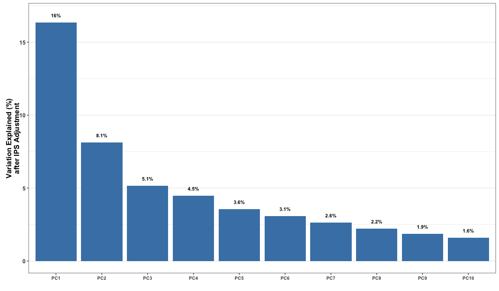<!-- -->

### Visualization of PC1 driver -- protein abundance 

```r
### read in protein abundance values and correlation with PC1 after standardisation
corPerPro.beforeIPS <- read.csv(paste0(intermidiate.out,"PC1 Driver - Intracellular Protein Score/corPerPro.beforeIPS.csv"), row.names = 1)

albminSeq.LDHseq <- read.csv(paste0(intermidiate.out,"PC1 Driver - Intracellular Protein Score/albminSeq.LDHseq.csv"),row.names=1, header  = TRUE)
albminSeq <- albminSeq.LDHseq["ALBUMIN",1]
LDHseq <- albminSeq.LDHseq["LDH",1]
  
p.abundance.PC1 <- ggplot(data=corPerPro.beforeIPS[is.finite(corPerPro.beforeIPS$Abundance),],aes(x=log(Abundance),y=Correlation)) + geom_point(color="royalblue4",size=0.5) + geom_smooth(method='lm',color="black") +
  geom_point(aes(x=log(corPerPro.beforeIPS[albminSeq,"Abundance"]),y=corPerPro.beforeIPS[albminSeq,"Correlation"]),color="#009E73",shape=24,size=2) +
  annotate(geom="text",x=log(corPerPro.beforeIPS[albminSeq,"Abundance"])-0.3, y=corPerPro.beforeIPS[albminSeq,"correlation"]-0.08, label="ALBUMIN",color="#009E73",size=3.5,fontface="bold") +
  geom_point(aes(x=log(corPerPro.beforeIPS[LDHseq,"Abundance"]),y=corPerPro.beforeIPS[LDHseq,"Correlation"]),color="#D55E00",shape=24,size=2) +
  annotate(geom="text",x=log(corPerPro.beforeIPS[LDHseq,"Abundance"])+2, y=corPerPro.beforeIPS[LDHseq,"Correlation"], label="LDH",color="#D55E00",size=3.5,fontface="bold") +
  xlab("Log Mean Protein Abundance") + ylab("Correlation Coefficient with PC1") + theme_bw() + 
  theme(axis.title.x = element_text(size=10,face="bold"),axis.text.x = element_text(size=10,face="bold"),
        axis.title.y =element_text(size=12.5,face="bold",vjust=-1),axis.text.y = element_text(size=10,face="bold"),
        legend.position = c(0.8,0.1),legend.title =element_text(size = 11,face="bold"), legend.text = element_text(size = 11,face="bold"),
        panel.grid.major = element_blank(), panel.grid.minor = element_blank()) 

### Replicate subplot of Figure 2:
p.abundance.PC1
```

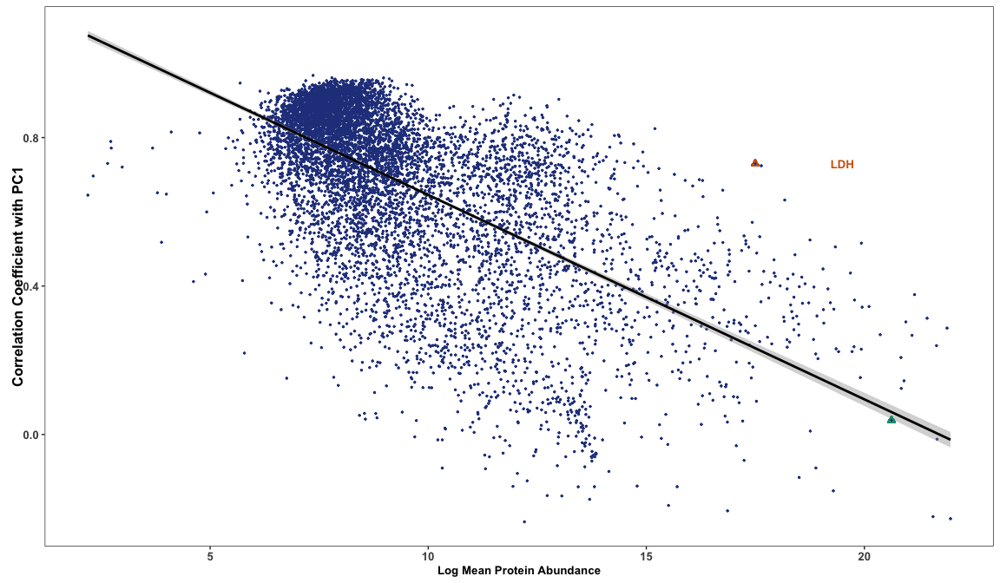<!-- -->

### Correlation with PC1 for 18 paired spun/unspun samples 

```r
### read in correlation values (i.e. correlation with PC1) for the 18 paired spun/unspun samples
spinFrame <- read.csv(paste0(intermidiate.out,"PC1 Driver - Intracellular Protein Score/spinFrame.csv"))

### set the color of each line on the plot according to the direction of change in correlation with PC1 after centrifucation ('spun')
p.spin.PC1 <- ggplot(data=spinFrame,aes(x=Spin,y=as.numeric(PC1))) + geom_point(aes(color=Spin),size=2) + geom_line(aes(group=rep(1:18,2),color=spin.col)) +
  xlab("") + ylab("PC1") + scale_x_discrete(limits=c("Unspun","Spun")) + theme_bw() +
  theme(axis.title.x = element_text(size=10,face="bold"),axis.text.x = element_text(size=10,face="bold"), axis.text.y = element_text(size=10,face="bold"),legend.position = "none",
        axis.title.y =element_text(size=12.5,face="bold",vjust=-1),panel.grid.major.x = element_blank())

### Generate subplot of Figure 2:
p.spin.PC1
```

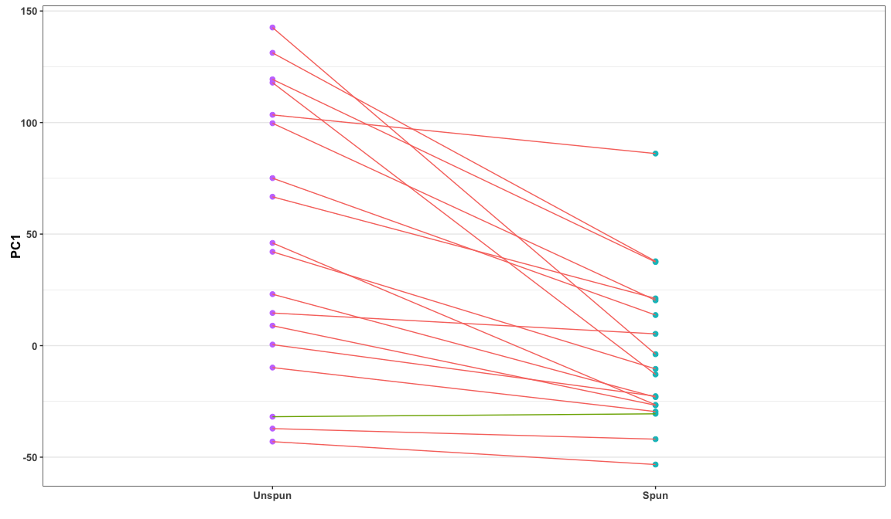<!-- -->

### Intracellular protein score vs PC1 using either IPS adjusted and non-IPS adjusted data

```r
### read in intracellular score and PC1 before and after IPS adjustment
IPSvsPC1 <- read.csv(paste0(intermidiate.out,"PC1 Driver - Intracellular Protein Score/IPSvsPC1.csv")) 

### calculate the pearson correlation coefficients between PC1 and intracellular protein score
cor.IPS.PC1.before <- signif(cor(IPSvsPC1$non.IPS.adjusted,IPSvsPC1$Intracellular.Protein.Score),2)
p.RegProBefore <- ggplot(IPSvsPC1) + geom_point(aes(x=non.IPS.adjusted,y=Intracellular.Protein.Score)) + geom_smooth(aes(x=non.IPS.adjusted,y=Intracellular.Protein.Score),method='lm',color="red") + 
  xlab("PC1 before IPS Adjustment") + ylab("Intracellular Protein Score") + annotate(geom="text",x=60, y=35000, label=paste0("Correlation Coefficient: ",cor.IPS.PC1.before),color="red",fontface = "bold",size=4) + theme_bw() + 
  theme(axis.text.x = element_text(size=10,face="bold"),axis.title.x =element_text(size = 10,face="bold"), 
        axis.text.y =element_text(size=10,face="bold"),axis.title.y =element_text(size=12.5,face="bold",vjust=-1)) 

cor.IPS.PC1.after <- signif(cor(IPSvsPC1$IPS.adjusted,IPSvsPC1$Intracellular.Protein.Score),2)
p.RegProAfter <- ggplot(IPSvsPC1) + geom_point(aes(x=IPS.adjusted,y=Intracellular.Protein.Score)) + geom_smooth(aes(x=IPS.adjusted,y=Intracellular.Protein.Score),method='lm',color="red") + 
  xlab("PC1 after IPS Adjustment") + ylab("Intracellular Protein Score") + annotate(geom="text",x=-50, y=35000, label=paste0("Correlation Coefficient: ",cor.IPS.PC1.after),color="red",fontface = "bold",size=4) + theme_bw() + 
  theme(axis.text.x = element_text(size=10,face="bold"),axis.title.x =element_text(size = 10,face="bold"), 
        axis.text.y =element_text(size=10,face="bold"),axis.title.y =element_text(size=12.5,face="bold",vjust=-1)) 

### Generate subplot of Figure 2:
p.RegProBefore
```

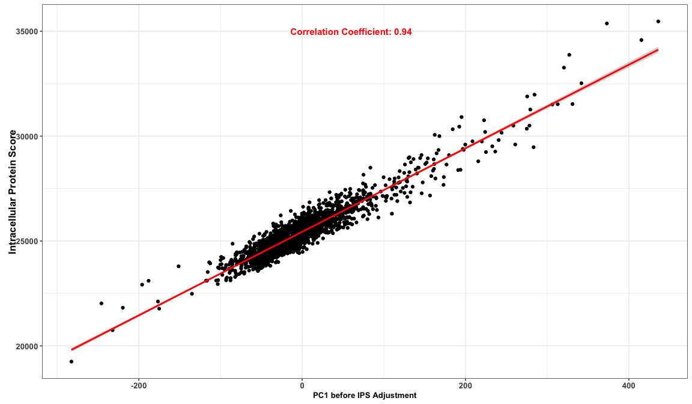<!-- -->

```r
p.RegProAfter
```

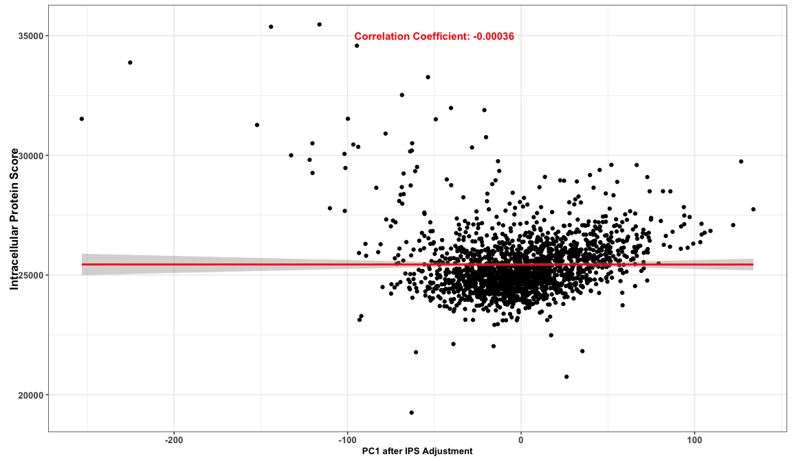<!-- -->

### Investigation of drivers of PC1 (regression model)

```r
### read in protein subcellular location information from Human Protein Atalas https://www.proteinatlas.org/humanproteome/subcellular 
SubLocation <- read.csv(paste0(intermidiate.out,"PC1 Driver - Intracellular Protein Score/subcellular_location.tsv"),sep="\t") 
SubLocationDat = SubLocation[,c("Gene.name","Main.location")]

CytoplasmL <- read.csv(paste0(intermidiate.out,"PC1 Driver - Intracellular Protein Score/Cytoplasm.txt"),header=FALSE)[,1]
NucleusL <- read.csv(paste0(intermidiate.out,"PC1 Driver - Intracellular Protein Score/Nucleus.txt"),header=FALSE)[,1]
EndomembraneL <- read.csv(paste0(intermidiate.out,"PC1 Driver - Intracellular Protein Score/Endomembrane.txt"),header=FALSE)[,1]
secreted <- SubLocation$Gene.name[which(SubLocation$Extracellular.location=="Predicted to be secreted")]

# for each protein define whether it is a 'secreted nuclear protein' (here we excluded the multiple locations)
for (indexCounter in 1:nrow(SubLocationDat)){
  x = SubLocationDat$Main.location[indexCounter]
  pro = SubLocationDat$Gene.name[indexCounter]
  mainLoc = strsplit(x,";")[[1]]
  if(any(CytoplasmL %in% mainLoc)){newLocation = "Cytoplasm"
  }else if(any(EndomembraneL %in% mainLoc)){newLocation = "Endomembrane"
  }else if(any(NucleusL %in% mainLoc) & !(any(pro %in% secreted))){newLocation = "Nucleus"
  }else{newLocation = NA}
  SubLocationDat$Broad.location[indexCounter]= newLocation
}

NucleusGenes <- SubLocationDat$Gene.name[which(SubLocationDat$Broad.location=="Nucleus")]

ProMeta <- read.csv(paste0(intermidiate.out,"PC1 Driver - Intracellular Protein Score/ProMeta.csv"))
keepseq <- which(ProMeta$Organism=="Human" & ProMeta$Type=="Protein")
Nucleus <- sapply(keepseq,function(x) {ifelse(any(ProMeta[x,"EntrezGeneSymbol"] %in% NucleusGenes),1,0)})

# Visualize the significant drivers: nuclear protein and protein abundance
### non-IPS adjusted data
driverNuclear.beforeIPS <- summary(lm(corPerPro.beforeIPS$Correlation[keepseq] ~ as.factor(Nucleus) + log(corPerPro.beforeIPS$Abundance[keepseq])))
driverNuclear.beforeIPS$coefficients
```

```
##                                                Estimate   Std. Error    t value
## (Intercept)                                  1.19309121 0.0083427405 143.009508
## as.factor(Nucleus)1                          0.03277124 0.0054273648   6.038149
## log(corPerPro.beforeIPS$Abundance[keepseq]) -0.05517403 0.0008454898 -65.256883
##                                                 Pr(>|t|)
## (Intercept)                                 0.000000e+00
## as.factor(Nucleus)1                         1.635458e-09
## log(corPerPro.beforeIPS$Abundance[keepseq]) 0.000000e+00
```

```r
### IPS adjusted data
corPerPro.afterIPS <- read.csv(paste0(intermidiate.out,"PC1 Driver - Intracellular Protein Score/corPerPro.afterIPS.csv"))
driverNuclear.afterIPS <- summary(lm(corPerPro.afterIPS$Correlation[keepseq] ~ as.factor(Nucleus) + log(corPerPro.afterIPS$Abundance[keepseq])))
driverNuclear.afterIPS$coefficients
```

```
##                                                Estimate   Std. Error    t value
## (Intercept)                                -0.165534813 0.0061358661 -26.978231
## as.factor(Nucleus)1                         0.012423007 0.0108146603   1.148719
## log(corPerPro.afterIPS$Abundance[keepseq]) -0.007812608 0.0009930221  -7.867506
##                                                 Pr(>|t|)
## (Intercept)                                7.086765e-153
## as.factor(Nucleus)1                         2.507095e-01
## log(corPerPro.afterIPS$Abundance[keepseq])  4.140385e-15
```

## Investigate the drivers of PC2 -- bimodal signal 
We also found a strong bimodal signal on PC2 which is highly correlated with laboratory processing batch

### UMAP before and after batch correction

```r
### read in data for the reduced dimension on Umap before bimodal signal batch correction
umap.BimodalBefore <- read.csv(paste0(intermidiate.out,"PC2 Driver - Bimodal Signal/umap.BimodalBefore.csv")) 

### read in data for the reduced dimension on Umap after bimodal signal batch correction
umap.BimodalAfter <- read.csv(paste0(intermidiate.out,"PC2 Driver - Bimodal Signal/umap.BimodalAfter.csv")) 

p.umap.BimodalBefore <- ggplot(umap.BimodalBefore) + geom_point(aes(x=D1,y=D2,color=as.factor(BimodalLabel)),size=1) +
  xlab("Dimension1") + ylab("Dimension2") + labs(color="Bimodal Signal Status") + scale_colour_manual(values = c("#D55E00","#009E73"),labels = c("Status1", "Status2")) + 
  guides(color = guide_legend(override.aes = list(size = 3))) + theme_bw() + 
  theme(axis.title.x = element_text(size=11,face="bold"),axis.text.x = element_text(size=10,face="bold"),
        axis.title.y =element_text(size=11,face="bold"), axis.text.y = element_text(size=10,face="bold"),
        legend.position="bottom", legend.title =element_text(size = 9,face="bold"), legend.text = element_text(size = 9,face="bold"),
        legend.margin=margin(0,0,0,0),legend.box.margin=margin(-4,-4,-4,-4))

p.umap.BimodalAfter <- ggplot(umap.BimodalAfter) + geom_point(aes(x=D1,y=D2,color=as.factor(BimodalLabel)),size=1) +
  xlab("Dimension1") + ylab("Dimension2") + labs(color="Bimodal Signal Status") + scale_colour_manual(values = c("#D55E00","#009E73"),labels = c("Status1", "Status2")) + 
  guides(color = guide_legend(override.aes = list(size = 3))) + theme_bw() +
  theme(axis.title.x = element_text(size=11,face="bold"),axis.text.x = element_text(size=10,face="bold"),
        axis.title.y =element_text(size=11,face="bold"), axis.text.y = element_text(size=10,face="bold"),
        legend.position="bottom", legend.title =element_text(size = 9,face="bold"), legend.text = element_text(size = 9,face="bold"),
        legend.margin=margin(0,0,0,0),legend.box.margin=margin(-4,-4,-4,-4))

### Generate subplots of Figure 3:
p.umap.BimodalBefore
```

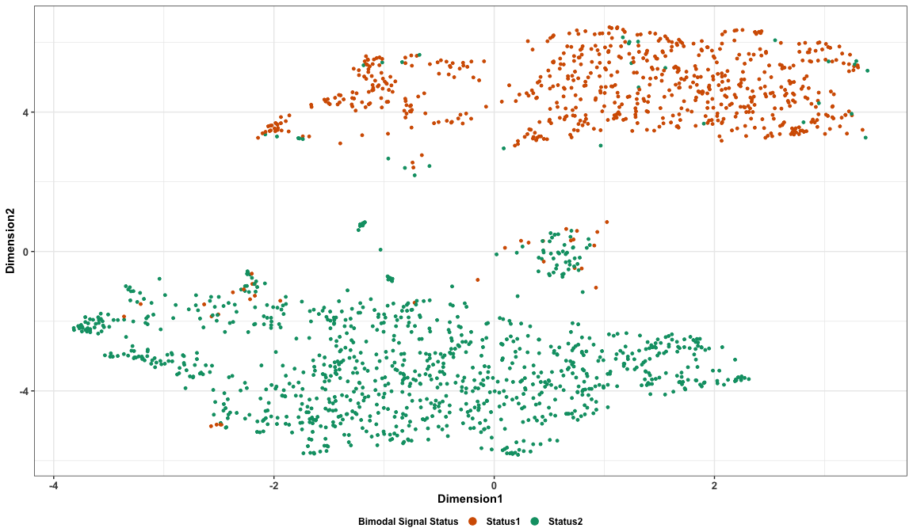<!-- -->

```r
p.umap.BimodalAfter
```

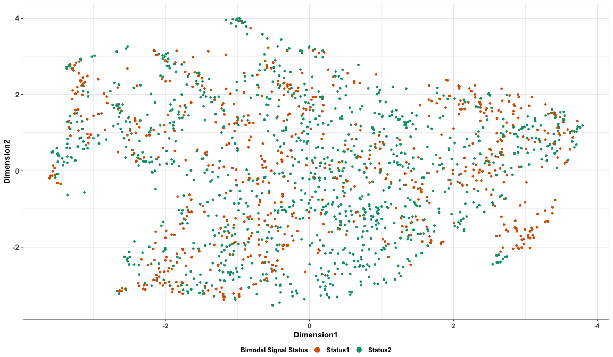<!-- -->

### Investigate one of the strongest bimodal signal marker proteins, TSG101, against processing batch

```r
### read in data for TSG101 vs processing order, processing batch; and for re-processed samples
plotData.TSG101 <- read.csv(paste0(intermidiate.out,"PC2 Driver - Bimodal Signal/plotData.TSG101.csv"),row.names = 1)
plotData.TSG101$ProcessingBatch <- as.factor(plotData.TSG101$ProcessingBatch)

### generate a variable corresponding to the different processing batches
cols <- rep(RColorBrewer::brewer.pal(9, "Set1"),100)[1:length(levels(plotData.TSG101$ProcessingBatch))]
names(cols) <- sort(as.numeric(levels(plotData.TSG101$ProcessingBatch)))

p.TSGseq <- ggplot(plotData.TSG101,aes(x=ProcessingOrder,y=TSG101,color=ProcessingBatch),group=ProcessingBatch) + geom_point(size=0.5) + 
  geom_line() + scale_colour_manual(values = cols) +
  xlab("Processing Order") + ylab("TSG101") + theme_bw() + 
  theme(legend.position="none",
        axis.title.x = element_text(size=11,face="bold"),axis.text.x = element_text(size=10,face="bold"),
        axis.title.y =element_text(size=11,face="bold"), axis.text.y = element_text(size=10,face="bold"))

### replication subplot of Figure 2:
p.TSGseq
```

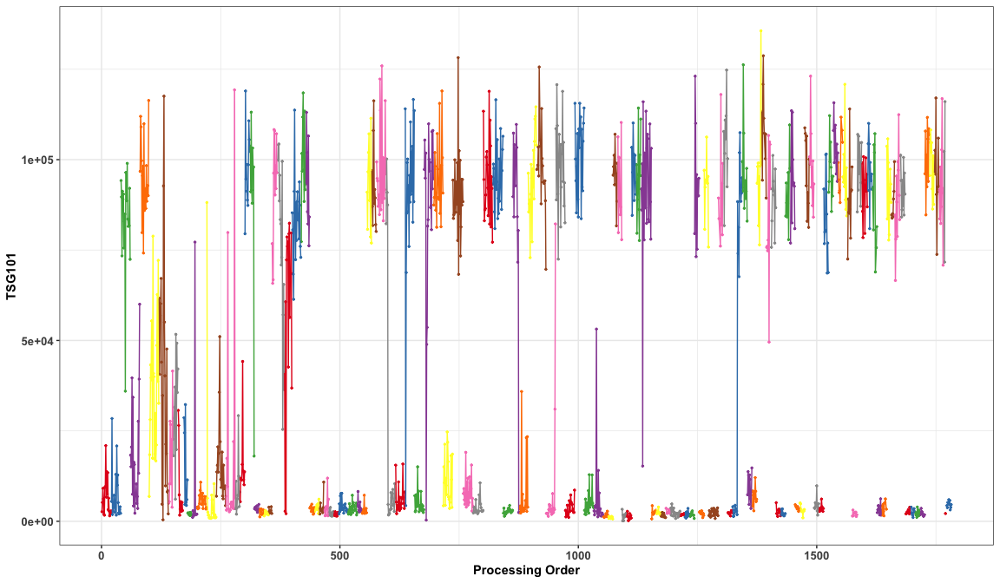<!-- -->


### Invetigate one of the strongest bimodal signal marker proteins, TSG101, when re-processed

```r
### read in TSG101 values for three samples which were reprocessed 
reprocessFrame <- read.csv(paste0(intermidiate.out,"PC2 Driver - Bimodal Signal/reprocessFrame.csv"))

p.reprocess <- ggplot(data=reprocessFrame) + geom_point(aes(x=Sample,y=as.numeric(TSG101),group=Processing,color=Processing)) +
  geom_line(aes(x=Sample,y=as.numeric(TSG101),group=Processing,color=Processing)) + labs(color="") + xlab("") + ylab("TSG101") + theme_bw() + 
  theme(axis.text.x = element_text(size=8,face="bold"),
        axis.title.y =element_text(size=10,face="bold"), axis.text.y = element_text(size=10,face="bold"),
        legend.position="top",legend.title =element_text(size = 8,face="bold"), legend.text = element_text(size = 8,face="bold"),
        legend.margin=margin(0,0,0,0),legend.box.margin=margin(-10,-10,-10,-10))

### replication subplot of Figure 2:
p.reprocess
```

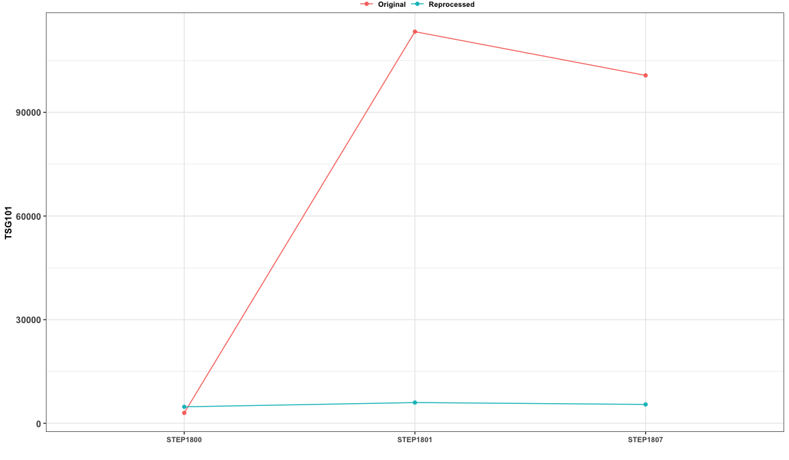<!-- -->

## Agreement between SOMAscan and immunoassay: comparing correlation coefficient values for raw, standardized, non-IPS/IPS adjusted data

```r
### read in correlation coefficient values assessing agreement between SomaScan and immunoassays for each normalisation procedure.
CorDatP.OA.IPS <- read.csv(paste0(intermidiate.out,"Compare to Immunoassay/CorDatP.OA.IPS.csv")) 
CorDatP.INJ.IPS <- read.csv(paste0(intermidiate.out,"Compare to Immunoassay/CorDatP.INJ.IPS.csv")) 

NormalisationLabel = c("Raw Data","Optimized Standardisation","Processed without IPS Adjustment","Processed with IPS Adjustment")

p.immunoassay.OA.IPS <- ggplot(data = CorDatP.OA.IPS) + geom_line(aes(x=as.character(CorC),y=as.numeric(CorDatY),group=CorDatX,col=CorDatX)) + ylim(-0.5,1) + scale_colour_manual(values = c("blue","seagreen","green","blueviolet","red","deepskyblue","hotpink","darkgoldenrod4","orange")) +
  xlab("") + ylab("Correlation Coefficient for OA Samples") +labs(color = "Protein") + scale_x_discrete(breaks=seq(1:length(NormalisationLabel)),labels=NormalisationLabel) + theme_bw() + 
  theme(axis.text.x = element_text(size=10, angle=20,face="bold",hjust=1),axis.text.y = element_text(size=10,face="bold"),
        legend.title =element_text(size = 10,face="bold"), legend.text = element_text(size = 10,face="bold"),
        axis.title.y =element_text(size=10,face="bold"),axis.title.x =element_text(size=10))

p.immunoassay.INJ.IPS <- ggplot(data = CorDatP.INJ.IPS) + geom_line(aes(x=as.character(CorC),y=as.numeric(CorDatY),group=CorDatX,col=CorDatX)) + ylim(-0.5,1) + scale_colour_manual(values = c("blue","seagreen","green","blueviolet","red","deepskyblue","hotpink","darkgoldenrod4","orange")) +
  xlab("") + ylab("Correlation Coefficient for Injury Samples") +labs(color = "Protein") + scale_x_discrete(breaks=seq(1:length(NormalisationLabel)),labels=NormalisationLabel) + theme_bw() + 
  theme(axis.text.x = element_text(size=10, angle=20,face="bold",hjust=1),axis.text.y = element_text(size=10,face="bold"),
        legend.title =element_text(size = 10,face="bold"), legend.text = element_text(size = 10,face="bold"),
        axis.title.y =element_text(size=10,face="bold"),axis.title.x =element_text(size=10))

### replicate Figure 4:
p.immunoassay.OA.IPS
```

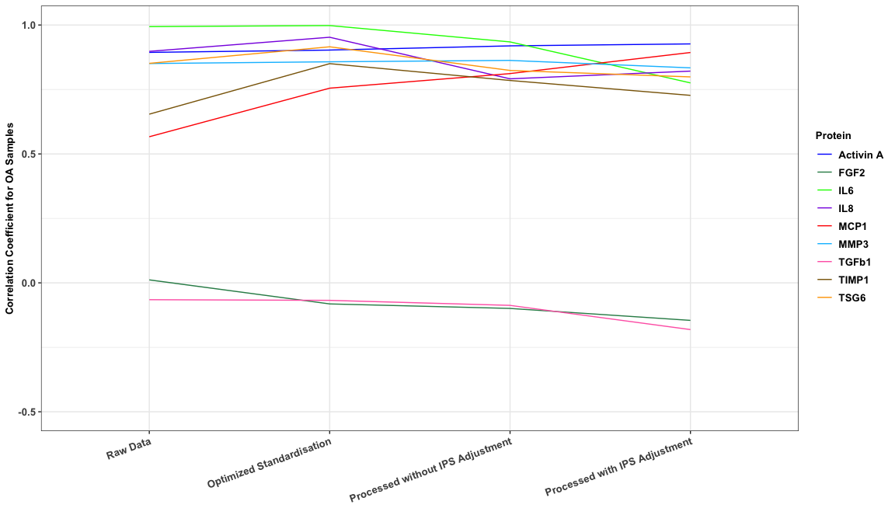<!-- -->

```r
p.immunoassay.INJ.IPS
```

<!-- -->

## UMAP visualisation on filtered data for non-IPS adjusted and IPS adjusted data

```r
### read in data for the reduced dimensions on Umap for non-IPS adjusted data
myUmap.BC.final.F <- read.csv(paste0(intermidiate.out,"Disease Group After Filtering/non-IPS adjusted.csv")) 

### read in data for the reduced dimensions on Umap for IPS adjusted data
myUmap.IPS.final.F <- read.csv(paste0(intermidiate.out,"Disease Group After Filtering/IPS adjusted.csv")) 

DiseaseSize1=ifelse(myUmap.BC.final.F$DiseaseGroup==4,"Big",ifelse(myUmap.BC.final.F$DiseaseGroup==3,"Mid","Small"))
p.umap.BC.Dis <- ggplot(data=myUmap.BC.final.F) + geom_point(aes(x=D1,y=D2,color=as.character(DiseaseGroup),size=DiseaseSize1)) +
  xlab("D1") + ylab("D2") + scale_colour_manual(name="Before IPS Adjustment", values = c("#D55E00","#009E73","black","purple"),labels=c('OA', 'Injury', 'Healthy control',"Inflammatory control")) + 
  scale_size_manual (values= c(2,2,1.5)) + guides(size=FALSE,color = guide_legend(override.aes = list(size = 3))) + theme_bw() + 
  theme(axis.title.x = element_text(size=12,face="bold"),axis.text.x = element_text(size=12,face="bold"),
        axis.title.y =element_text(size=12,face="bold"), axis.text.y = element_text(size=12,face="bold"),
        legend.title =element_text(size = 13,face="bold"), legend.text = element_text(size = 12,face="bold"))

DiseaseSize2=ifelse(myUmap.IPS.final.F$DiseaseGroup==4,"Big",ifelse(myUmap.IPS.final.F$DiseaseGroup==3,"Mid","Small"))
p.umap.IPS.Dis <- ggplot(data=myUmap.IPS.final.F) + geom_point(aes(x=D1,y=D2,color=as.character(DiseaseGroup),size=DiseaseSize2)) +
  xlab("D1") + ylab("D2") + scale_colour_manual(name="After IPS Adjustment", values = c("#D55E00","#009E73","black","purple"),labels=c('OA', 'Injury', 'Healthy control',"Inflammatory control")) + 
  scale_size_manual (values= c(2,2,1.5)) + guides(size=FALSE,color = guide_legend(override.aes = list(size = 3))) + theme_bw() + 
  theme(axis.title.x = element_text(size=12,face="bold"),axis.text.x = element_text(size=12,face="bold"),
        axis.title.y =element_text(size=12,face="bold"), axis.text.y = element_text(size=12,face="bold"),
        legend.title =element_text(size = 13,face="bold"), legend.text = element_text(size = 12,face="bold"))

### plot Figure 7:
p.umap.BC.Dis
```

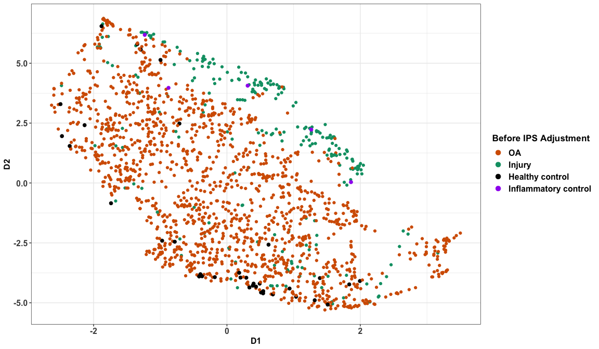<!-- -->

```r
p.umap.IPS.Dis
```

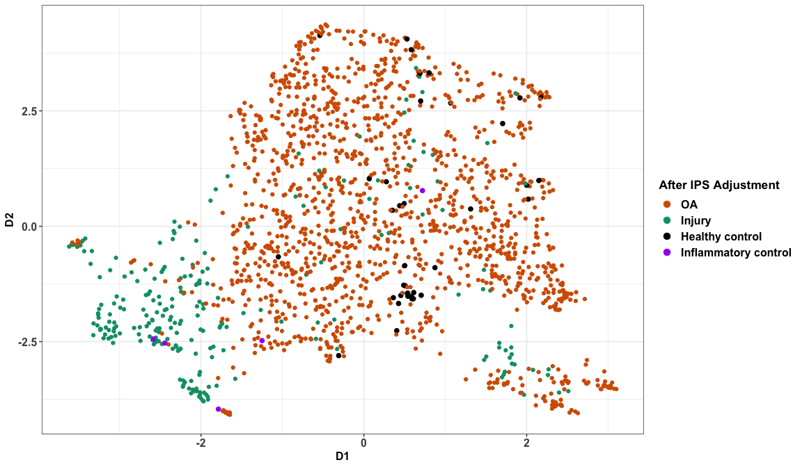<!-- -->
